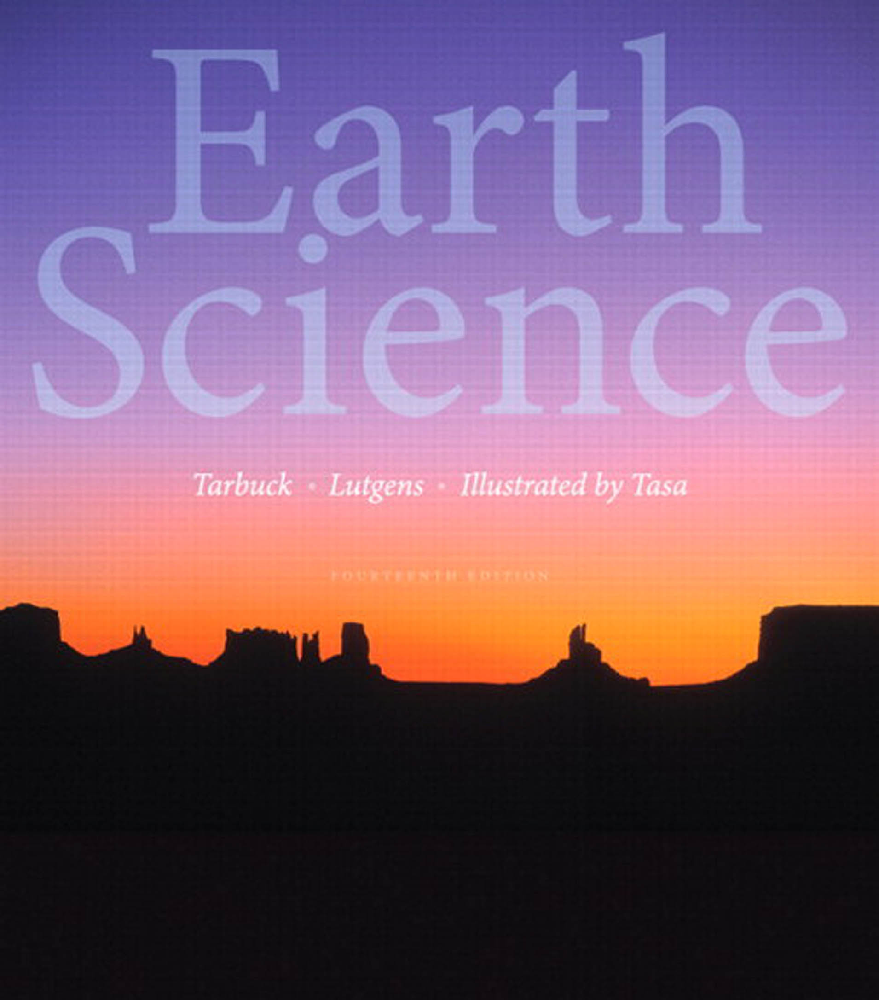

# Earth Science

《地球科学》（第14版） by Edward J. Tarbuck, Frederick K. Lutgens —— 中文翻译

翻译模型：Gemini 3 Pro Preview

本书插图很多，格式复杂，很难用markdown或者html展示处理，所以在此只提供文字部分内容，供快速浏览、检索用。如果真的通读，建议直接看英文版，或者对照英文版读中文翻译。

可以在anna's archive等处下载英文原版，搜索关键词：“Earth Science (14th Edition)”

---

### 《地球科学》（第14版）

- [目录](00%20a%20目录.md)
- [前言](00%20b%20前言.md)
- [01 地球科学导论](01%20地球科学导论.md)
- [02 物质与矿物](02%20物质与矿物.md)
- [03 岩石：固体地球的物质](03%20岩石：固体地球的物质.md)
- [04 风化、土壤和块体运动](04%20风化、土壤和块体运动.md)
- [05 地表水与地下水](05%20地表水与地下水.md)
- [06 冰川、荒漠与风](06%20冰川、荒漠与风.md)
- [07 板块构造：一场科学革命的开始](07%20板块构造：一场科学革命的开始.md)
- [08 地震与地球内部](08%20地震与地球内部.md)
- [09 火山和其他岩浆活动](09%20火山和其他岩浆活动.md)
- [10 地壳变形与造山运动](10%20地壳变形与造山运动.md)
- [11 地质年代](11%20地质年代.md)
- [12 地质年代中的地球演化](12%20地质年代中的地球演化.md)
- [13 海床](13%20海床.md)
- [14 海水与海洋生物](14%20海水与海洋生物.md)
- [15 动态的海洋](15%20动态的海洋.md)
- [16 大气圈：组成、结构和温度](16%20大气圈：组成、结构和温度.md)
- [17 湿度、云和降水](17%20湿度、云和降水.md)
- [18 气压与风](18%20气压与风.md)
- [19 天气模式与强烈风暴](19%20天气模式与强烈风暴.md)
- [20 世界气候与全球气候变化](20%20世界气候与全球气候变化.md)
- [21 现代天文学的起源](21%20现代天文学的起源.md)
- [22 漫游我们的太阳系](22%20漫游我们的太阳系.md)
- [23 光、天文观测和太阳](23%20光、天文观测和太阳.md)
- [24 在我们的太阳系之外](24%20在我们的太阳系之外.md)
- [附录](25%20附录.md)

---

